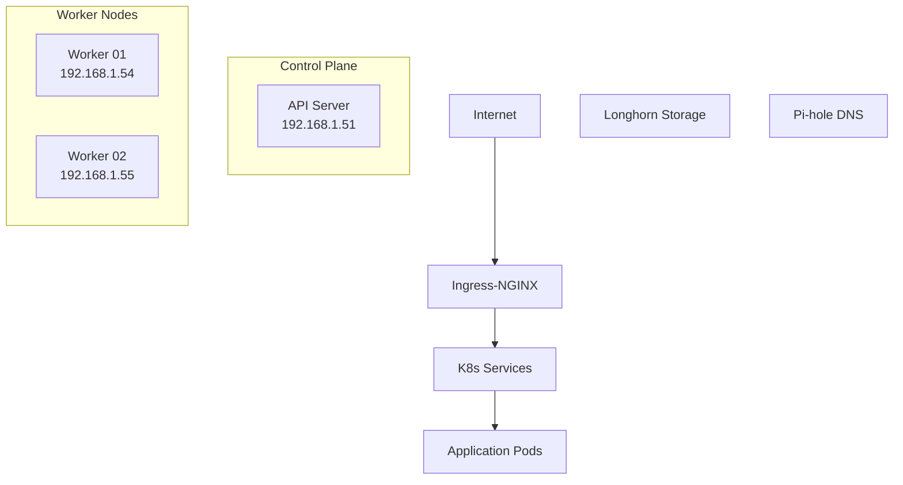

# Infrastrcuture 

### Kubernetes Cluster Topology (Bare Metal)
Node Configuration

Control Plane:
- Single control plane node (talos-cp-01)
- Beelink Mini hardware
- IP: 192.168.1.51
- Minimum specs: 2 cores, 2GB RAM, 50GB storage

Worker Nodes:
- Two Dell Optiplex machines
- talos-worker-01: 192.168.1.54
- talos-worker-02: 192.168.1.55
- Minimum specs per node: 4 cores, 4GB RAM, 100GB storage

### Kubernetes Core Add-On

- [longhorn/longhorn](https://github.com/longhorn/longhorn): Distributed block storage for persistent storage.
- [metallb/metallb](https://github.com/metallb/metallb): Load-balancer implementation for bare metal Kubernetes clusters, using standard routing protocols.
- [kubernetes/ingress-nginx](https://github.com/kubernetes/ingress-nginx): Manages reverse-proxy access to Kubernetes services.
- [pi-hole/pi-hole](https://github.com/pi-hole/pi-hole): Home DNS.
- [kubernetes-sigs/external-dns](https://github.com/kubernetes-sigs/external-dns): Automatically manages DNS records from my cluster in a cloud DNS provider.
- [argoproj/argo-cd](https://github.com/argoproj/argo-cd): Declarative, GitOps continuous delivery tool for Kubernetes.

### Helmfile
The Kuberentes core add-on managed and deployed by helmfile.

