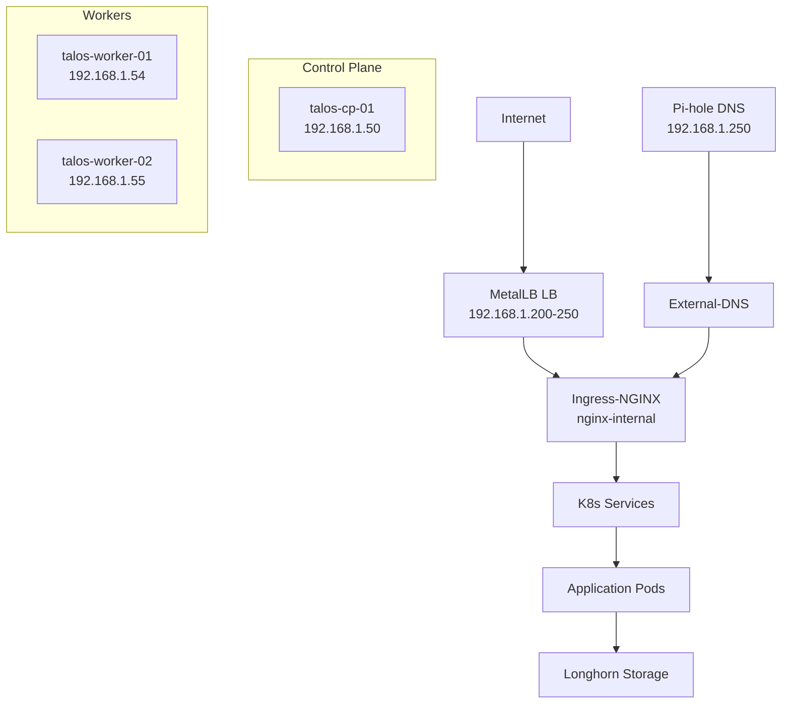

# Infrastructure

## Kubernetes Cluster Topology

Bare-metal cluster running [Talos Linux](https://www.talos.dev/) managed via GitOps.

|Node|Role|Hardware|IP|
|---|---|---|---|
|talos-cp-01|Control Plane|Beelink Mini|192.168.1.50|
|talos-worker-01|Worker|Dell Optiplex|192.168.1.54|
|talos-worker-02|Worker|Dell Optiplex|192.168.1.55|

**Control Plane specs:** 4 cores, 4GB RAM, 512GB SSD  
**Worker specs:** 4 cores, 4GB RAM, 100GB storage (min)


```mermaid
graph TD
    Internet --> MetalLB[MetalLB LB<br/>192.168.1.200-250]
    MetalLB --> Ingress[Ingress-NGINX<br/>nginx-internal]
    Ingress --> Services[K8s Services]
    Services --> Pods[Application Pods]
    Pods --> Storage[Longhorn Storage]

    DNS[Pi-hole DNS<br/>192.168.1.250] --> ExternalDNS[External-DNS]
    ExternalDNS --> Ingress

    subgraph Control Plane
        API[talos-cp-01<br/>192.168.1.50]
    end

    subgraph Workers
        Worker1[talos-worker-01<br/>192.168.1.54]
        Worker2[talos-worker-02<br/>192.168.1.55]
    end
```

## Repository Structure

```text
k8s-homelab/
├── talos/                  # Talos Linux cluster configuration
│   ├── README.md           # Bootstrap and operations guide
│   ├── schematic.yaml      # Talos factory image schematic
│   ├── configs/            # Generated machine configs (gitignored)
│   └── patches/            # Node-specific config patches
│       ├── cp-01.yaml      # Control plane: hostname, PodSecurity, CNI=none
│       └── worker-01.yaml  # Worker-01: hostname, Longhorn extensions
├── infrastructure/         # Helm releases managed by Helmfile
│   ├── README.md           # Operations guide
│   ├── helmfile.yaml       # Root: repos, defaults, active releases
│   └── releases/           # One directory per Helm release
│       ├── metallb/        # Load balancer (L2 mode, 192.168.1.200-250)
│       ├── ingress-nginx/  # Ingress controller (nginx-internal)
│       ├── pihole/         # DNS + ad-block (192.168.1.250)
│       ├── external-dns/   # Auto DNS records from Ingress
│       └── longhorn/       # Distributed block storage
└── docs/                   # Documentation
    ├── infrastructure.md   # This file
    ├── networking.md       # IP allocation and networking
    └── repo-structure.md   # Repo layout overview
```

## Core Add-Ons

|Add-on|Purpose|Docs|
|---|---|---|
|[Longhorn](https://github.com/longhorn/longhorn)|Distributed block storage|[helmfile.md](helmfile.md)|
|[MetalLB](https://github.com/metallb/metallb)|Bare-metal load balancer|[helmfile.md](helmfile.md)|
|[Ingress-NGINX](https://github.com/kubernetes/ingress-nginx)|Ingress / reverse proxy|[helmfile.md](helmfile.md)|
|[Pi-hole](https://github.com/pi-hole/pi-hole)|Home DNS server|[helmfile.md](helmfile.md)|
|[External-DNS](https://github.com/kubernetes-sigs/external-dns)|Auto DNS from Ingress|[helmfile.md](helmfile.md)|
|[ArgoCD](https://github.com/argoproj/argo-cd)|GitOps CD|[helmfile.md](helmfile.md)|

All releases are managed and deployed via Helmfile. See [helmfile.md](helmfile.md) for full details.
